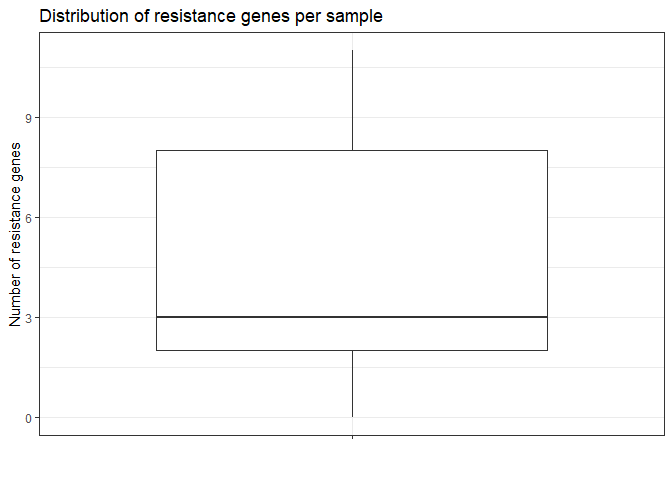
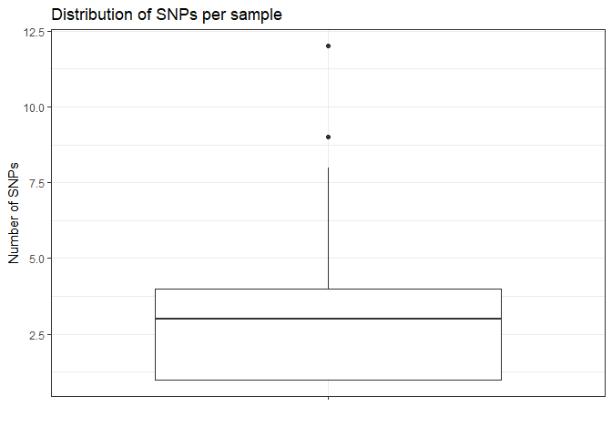
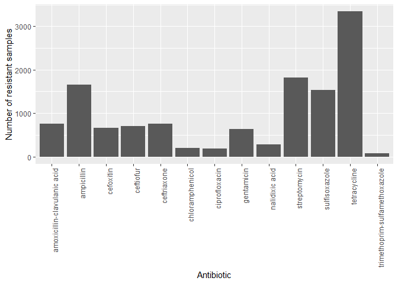
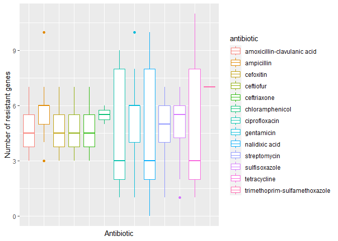
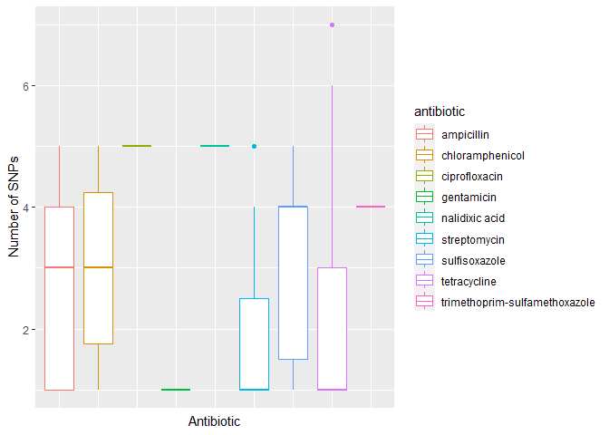

Data exploration
================
Geovanny Risco
May 17, 2023

- <a href="#1-import-libraries" id="toc-1-import-libraries">1 Import
  libraries</a>
- <a href="#2-import-data" id="toc-2-import-data">2 Import data</a>
- <a href="#3-clean-and-prepare-data" id="toc-3-clean-and-prepare-data">3
  Clean and prepare data</a>
  - <a href="#31-args" id="toc-31-args">3.1 ARGs</a>
    - <a href="#311-null-values-detection"
      id="toc-311-null-values-detection">3.1.1 Null values detection</a>
    - <a href="#312-outliers-detection" id="toc-312-outliers-detection">3.1.2
      Outliers detection</a>
  - <a href="#32-snps" id="toc-32-snps">3.2 SNPs</a>
    - <a href="#321-preparation" id="toc-321-preparation">3.2.1
      Preparation</a>
    - <a href="#322-null-values-detection"
      id="toc-322-null-values-detection">3.2.2 Null values detection</a>
    - <a href="#323-outliers-analysis" id="toc-323-outliers-analysis">3.2.3
      Outliers analysis</a>
  - <a href="#33-amr-labels" id="toc-33-amr-labels">3.3 AMR labels</a>
    - <a href="#331-preparation" id="toc-331-preparation">3.3.1
      Preparation</a>
    - <a href="#332-cleaning" id="toc-332-cleaning">3.3.2 Cleaning</a>
    - <a href="#333-exploration" id="toc-333-exploration">3.3.3
      Exploration</a>
- <a href="#4-explore-data" id="toc-4-explore-data">4 Explore data</a>
- <a href="#5-save-data" id="toc-5-save-data">5 Save data</a>

# 1 Import libraries

``` r
library(tidyverse)
```

    ## Warning: package 'tidyverse' was built under R version 4.1.3

    ## -- Attaching packages --------------------------------------- tidyverse 1.3.2 --
    ## v ggplot2 3.4.1     v purrr   1.0.1
    ## v tibble  3.1.8     v dplyr   1.1.0
    ## v tidyr   1.3.0     v stringr 1.5.0
    ## v readr   2.1.4     v forcats 1.0.0

    ## Warning: package 'ggplot2' was built under R version 4.1.3

    ## Warning: package 'tibble' was built under R version 4.1.3

    ## Warning: package 'tidyr' was built under R version 4.1.3

    ## Warning: package 'readr' was built under R version 4.1.3

    ## Warning: package 'purrr' was built under R version 4.1.3

    ## Warning: package 'dplyr' was built under R version 4.1.3

    ## Warning: package 'stringr' was built under R version 4.1.3

    ## Warning: package 'forcats' was built under R version 4.1.3

    ## -- Conflicts ------------------------------------------ tidyverse_conflicts() --
    ## x dplyr::filter() masks stats::filter()
    ## x dplyr::lag()    masks stats::lag()

# 2 Import data

``` r
batch_number <- "_batch3"
```

``` r
# ARGs (Antibiotic Resistance Genes)
args_data_filepath <- paste0("data/results/args_calling/args_table", batch_number, ".csv")
args_data <- read_csv(args_data_filepath, col_types = cols("sample_name" = col_character()))
## Fix/extract name of samples
args_data <- args_data %>%
  mutate(sample_name = str_extract(sample_name, "^\\w+.\\d+"))
args_data
```

    ## # A tibble: 6,306 x 162
    ##    sample_name    NarA  NarB aac(3~1 aac(3~2 aac(6~3 aac(6~4 aadA1 aadA2 aadE-~5
    ##    <chr>         <dbl> <dbl>   <dbl>   <dbl>   <dbl>   <dbl> <dbl> <dbl>   <dbl>
    ##  1 GCA_01263718~     0     0       0       0       0       0     0     0       0
    ##  2 GCA_01263728~     0     0       0       0       0       0     0     0       0
    ##  3 GCA_01263731~     0     0       0       0       0       0     0     0       0
    ##  4 GCA_01263738~     0     0       0       0       0       0     0     0       0
    ##  5 GCA_01263742~     0     0       0       0       0       0     0     0       0
    ##  6 GCA_01263744~     0     0       0       0       0       0     0     0       0
    ##  7 GCA_01263748~     0     0       0       0       0       0     0     0       0
    ##  8 GCA_01263786~     0     0       0       0       0       0     0     0       0
    ##  9 GCA_01264252~     0     0       0       0       0       0     0     0       0
    ## 10 GCA_01264264~     0     0       0       0       0       0     0     0       0
    ## # ... with 6,296 more rows, 152 more variables: `ant(2'')-Ia` <dbl>,
    ## #   `ant(6)-Ia` <dbl>, `aph(2'')-Ia` <dbl>, `aph(2'')-Ic` <dbl>,
    ## #   `aph(2'')-If` <dbl>, `aph(2'')-Ig` <dbl>, `aph(3'')-Ib` <dbl>,
    ## #   `aph(3')-III` <dbl>, `aph(3')-IIa` <dbl>, `aph(3')-Ia` <dbl>,
    ## #   `aph(6)-Ic` <dbl>, `aph(6)-Id` <dbl>, `blaCMY-2` <dbl>, `blaHERA-3` <dbl>,
    ## #   `blaOXA-184` <dbl>, `blaOXA-193` <dbl>, `blaOXA-448` <dbl>,
    ## #   `blaOXA-449` <dbl>, `blaOXA-450` <dbl>, `blaOXA-451` <dbl>, ...

``` r
# SNPs (Single Nucleotide Polymorphisms)
snps_data_filepath <- paste0("data/results/variant_calling/snps_data", batch_number, ".tsv")
snps_data <- read_tsv(snps_data_filepath, col_names = c("chrom", "pos", "ref", "alt", "tgt", "gene_name", "gene_pos", "tax_id", "sample_name"), na = c("."))
```

    ## Warning: One or more parsing issues, call `problems()` on your data frame for details,
    ## e.g.:
    ##   dat <- vroom(...)
    ##   problems(dat)

    ## Rows: 22136 Columns: 9
    ## -- Column specification --------------------------------------------------------
    ## Delimiter: "\t"
    ## chr (6): chrom, ref, alt, tgt, gene_name, sample_name
    ## dbl (3): pos, gene_pos, tax_id
    ## 
    ## i Use `spec()` to retrieve the full column specification for this data.
    ## i Specify the column types or set `show_col_types = FALSE` to quiet this message.

``` r
# Fix/extract name of samples
snps_data <- snps_data %>%
  mutate(sample_name = str_extract(sample_name, "^\\w+.\\d+"))
snps_data
```

    ## # A tibble: 22,136 x 9
    ##    chrom             pos ref   alt   tgt   gene_name   gene_pos tax_id sample_~1
    ##    <chr>           <dbl> <chr> <chr> <chr> <chr>          <dbl>  <dbl> <chr>    
    ##  1 NZ_KB944666.1 2170478 A     G     A/G   WMS_RS13655      234   1351 1351.853 
    ##  2 NZ_KB944666.1 2170481 C     T     C/T   WMS_RS13655      237   1351 1351.853 
    ##  3 NZ_KB944666.1 2170493 T     C     T/C   WMS_RS13655      249   1351 1351.853 
    ##  4 NZ_KB944666.1 2170505 T     G     T/G   WMS_RS13655      261   1351 1351.853 
    ##  5 NZ_KB944666.1 2170514 G     A     G/A   WMS_RS13655      270   1351 1351.853 
    ##  6 NZ_KB944666.1 2170548 A     G     A/G   WMS_RS13655      304   1351 1351.853 
    ##  7 NZ_KB944666.1 2170556 C     T     C/T   WMS_RS13655      312   1351 1351.853 
    ##  8 NZ_KB944666.1 2170559 T     C     T/C   WMS_RS13655      315   1351 1351.853 
    ##  9 NZ_KB944666.1 2170562 C     G     C/G   WMS_RS13655      318   1351 1351.853 
    ## 10 NZ_KB944666.1 2170571 A     G     A/G   WMS_RS13655      327   1351 1351.853 
    ## # ... with 22,126 more rows, and abbreviated variable name 1: sample_name

``` r
# Reference genomes (in BED format)

## Loop through reference genomes folder and read BED files
refs_genomes_dir <- "data/reference_genomes"
refs_genomes_files <- list.files(refs_genomes_dir, pattern = ".bed", full.names = TRUE, recursive = TRUE)
## Read each of the BED files and store them ina dictionary which key is the name of the file and the values a list of genes
refs_genomes <- list()
for (file in refs_genomes_files) {
  tax_id <- str_remove(basename(file), ".bed")
  refs_genomes[tax_id] <- read_tsv(file, col_select = 4)
}
```

    ## Rows: 2727 Columns: 1
    ## -- Column specification --------------------------------------------------------
    ## Delimiter: "\t"
    ## chr (1): WMS_RS03090
    ## 
    ## i Use `spec()` to retrieve the full column specification for this data.
    ## i Specify the column types or set `show_col_types = FALSE` to quiet this message.
    ## Rows: 1749 Columns: 1
    ## -- Column specification --------------------------------------------------------
    ## Delimiter: "\t"
    ## chr (1): dcuC
    ## 
    ## i Use `spec()` to retrieve the full column specification for this data.
    ## i Specify the column types or set `show_col_types = FALSE` to quiet this message.
    ## Rows: 1627 Columns: 1
    ## -- Column specification --------------------------------------------------------
    ## Delimiter: "\t"
    ## chr (1): dnaA
    ## 
    ## i Use `spec()` to retrieve the full column specification for this data.
    ## i Specify the column types or set `show_col_types = FALSE` to quiet this message.
    ## Rows: 4672 Columns: 1
    ## -- Column specification --------------------------------------------------------
    ## Delimiter: "\t"
    ## chr (1): thrL
    ## 
    ## i Use `spec()` to retrieve the full column specification for this data.
    ## i Specify the column types or set `show_col_types = FALSE` to quiet this message.
    ## Rows: 4493 Columns: 1
    ## -- Column specification --------------------------------------------------------
    ## Delimiter: "\t"
    ## chr (1): thrL
    ## 
    ## i Use `spec()` to retrieve the full column specification for this data.
    ## i Specify the column types or set `show_col_types = FALSE` to quiet this message.

``` r
# AMR (Antimicrobial Resistance) labels
amr_labels <- read_csv("data/results/data_collection_ncbi/amr_labels.csv", col_types = cols("SampleID" = col_character()))
amr_labels
```

    ## # A tibble: 6,242 x 23
    ##    SampleID     amikacin amoxi~1 ampic~2 cefox~3 cefti~4 ceftr~5 chlor~6 cipro~7
    ##    <chr>           <dbl>   <dbl>   <dbl>   <dbl>   <dbl>   <dbl>   <dbl>   <dbl>
    ##  1 SAMN04256112        0       1       1       1       1       1       0       0
    ##  2 SAMN04256111        0       0       0       0       0       0       0       0
    ##  3 SAMN04256110        0       0       0       0       0       0       0       0
    ##  4 SAMN04256109        0       0       0       0       0       0       0       0
    ##  5 SAMN04256108        0       0       0       0       0       0       0       0
    ##  6 SAMN04256107        0       0       1       0       0       0       0       0
    ##  7 SAMN04256106        0       0       0       0       0       0       0       0
    ##  8 SAMN04256105        0       1       1       1       1       1       0       0
    ##  9 SAMN04256104        0       1       1       1       1       1       0       0
    ## 10 SAMN04256103        0       1       1       1       1       1       0       0
    ## # ... with 6,232 more rows, 14 more variables: gentamicin <dbl>,
    ## #   kanamycin <dbl>, `nalidixic acid` <dbl>, streptomycin <dbl>,
    ## #   sulfisoxazole <dbl>, tetracycline <dbl>,
    ## #   `trimethoprim-sulfamethoxazole` <dbl>, sulfamethoxazole <dbl>,
    ## #   azithromycin <dbl>, meropenem <dbl>, clindamycin <dbl>, erythromycin <dbl>,
    ## #   florfenicol <dbl>, telithromycin <dbl>, and abbreviated variable names
    ## #   1: `amoxicillin-clavulanic acid`, 2: ampicillin, 3: cefoxitin, ...

``` r
# Load NCBI samples metadata
samples_metadata <- read_tsv("data/results/data_collection_ncbi/assembly_accession_ids+tax_ids.txt", col_names = c("biosample_accession", "assembly_accession", "tax_id"))
```

    ## Rows: 6208 Columns: 3
    ## -- Column specification --------------------------------------------------------
    ## Delimiter: "\t"
    ## chr (2): biosample_accession, assembly_accession
    ## dbl (1): tax_id
    ## 
    ## i Use `spec()` to retrieve the full column specification for this data.
    ## i Specify the column types or set `show_col_types = FALSE` to quiet this message.

``` r
samples_metadata
```

    ## # A tibble: 6,208 x 3
    ##    biosample_accession assembly_accession tax_id
    ##    <chr>               <chr>               <dbl>
    ##  1 SAMN03842331        GCA_006813885.2     28901
    ##  2 SAMN03988294        GCA_008404065.2     28901
    ##  3 SAMN05596322        GCA_022569775.1     28901
    ##  4 SAMN04563576        GCA_020381005.1       562
    ##  5 SAMN04588431        GCA_008474925.2     28901
    ##  6 SAMN04530411        GCA_008471245.2     28901
    ##  7 SAMN04536994        GCA_008471305.2     28901
    ##  8 SAMN05440588        GCA_008524845.2     28901
    ##  9 SAMN04605174        GCA_008412045.2     28901
    ## 10 SAMN04964189        GCA_008474065.2     28901
    ## # ... with 6,198 more rows

For now and until BV-BRC is active again, we will filter out 1351
samples (which are not in NCBI). In order to add BV-BRC samples, we need
to parse AMR labels information in a different way:

``` r
amr_labels <- amr_labels %>%
  filter(`SampleID` %in% samples_metadata$biosample_accession)
snps_data <- snps_data %>%
  filter(sample_name %in% samples_metadata$assembly_accession)
args_data <- args_data %>%
  filter(sample_name %in% samples_metadata$assembly_accession)
```

# 3 Clean and prepare data

First of all, we will need to clean and prepare the data in order to
perform the analysis.

## 3.1 ARGs

This table has the following structure:

| sample_name     | GeneA | GeneB | GeneC |   … |
|:----------------|:------|:------|:------|----:|
| GCA_012637185.1 | 0     | 1     | 0     |   … |
| …               | …     | …     | …     |   … |

For each gene, a boolean value is given dependending on whether the gene
is resistance or not.

- 1: resistance gene
- 0: non-resistance gene

### 3.1.1 Null values detection

``` r
# Count number of nulls per sample
args_data %>%
  mutate(nulls = rowSums(is.na(select(., -sample_name)))) %>%
  select(sample_name, nulls) %>%
  arrange(desc(nulls))
```

    ## # A tibble: 6,208 x 2
    ##    sample_name     nulls
    ##    <chr>           <dbl>
    ##  1 GCA_012637185.1     0
    ##  2 GCA_012637285.1     0
    ##  3 GCA_012637315.1     0
    ##  4 GCA_012637385.1     0
    ##  5 GCA_012637425.1     0
    ##  6 GCA_012637445.1     0
    ##  7 GCA_012637485.1     0
    ##  8 GCA_012637865.1     0
    ##  9 GCA_012642525.1     0
    ## 10 GCA_012642645.1     0
    ## # ... with 6,198 more rows

We have no nulls values for ARGs.

### 3.1.2 Outliers detection

``` r
# For each sample, how many resistance genes are present?
args_data %>%
  mutate(count = rowSums(select(., -sample_name))) %>%
  select(sample_name, count) %>%
  arrange(desc(count))
```

    ## # A tibble: 6,208 x 2
    ##    sample_name     count
    ##    <chr>           <dbl>
    ##  1 GCA_007758465.1    23
    ##  2 GCA_008551155.1    21
    ##  3 GCA_008477615.1    20
    ##  4 GCA_008469665.1    19
    ##  5 GCA_007194375.1    19
    ##  6 GCA_007742235.1    18
    ##  7 GCA_008478965.1    18
    ##  8 GCA_008552695.1    18
    ##  9 GCA_008474545.1    18
    ## 10 GCA_007763135.1    18
    ## # ... with 6,198 more rows

``` r
# Mean number of resistance genes per sample
args_data %>%
  mutate(count = rowSums(select(., -sample_name))) %>%
  summarise(mean(count)) %>%
  pull()
```

    ## [1] 3.627416

``` r
# Boxplot summarizing above information
args_data %>%
  mutate(count = rowSums(select(., -sample_name))) %>%
  ggplot(aes(x = "", y = count)) +
  geom_boxplot() +
  labs(x = "", y = "Number of resistance genes", title = "Distribution of resistance genes per sample") +
  theme_bw()
```

<!-- -->

\#TODO: add analysis when final data is ready

## 3.2 SNPs

### 3.2.1 Preparation

In this case, we will need to perform preparation steps for each sample,
since the table has a different structure.

| chrom         | pos     | ref | alt | tgt | gene_name     | gene_pos | tax_id |     sample_name |
|:--------------|:--------|:----|:----|:----|:--------------|:---------|:-------|----------------:|
| NC_002695.2   | 1250767 | T   | C   | T/C | ECs_1169      | 511.0    | 562    | GCA_012688215.1 |
| NC_002695.2   | 1250712 | C   | A   | C/A | ECs_1169      | 456.0    | 562    | GCA_012688215.1 |
| NZ_CP046317.1 | 218754  | T   | G   | T/G | FOC43_RS01045 | 603      | 195    | GCA_005283725.1 |
| …             | …       | …   | …   | …   | …             | …        | …      |               … |

Here is a brief description of each column:

- chrom: chromosome in which the SNP is located
- pos: position of the SNP in the chromosome
- ref: reference nucleotide (the one that is expected to be found in the
  sample)
- alt: alternative nucleotide (the one that is actually found in the
  sample, that is, the mutation/SNP)
- tgt: translated genotype, or in other words, the ref and alt
  nucleotides in a single string (ref/alt). \#TODO: double check this
- gene_name: name of the gene in which the SNP is located
- gene_pos: position of the SNP in the gene
- tax_id: taxonomic id of the sample
- sample_name: name of the sample

Most of this information has been extracted from the VCF file generated
by the variant calling pipeline. More information about the VCF format
can be found [here](https://samtools.github.io/hts-specs/VCFv4.2.pdf).

In order to use this data for ML purposes, we need to transform it into
a table with the following structure:

sample_name \| gene_name1/gene1_pos1 \| gene_name1/gene1_pos2 \|
gene_name2/gene2_pos1 \| …

For the previous example, the table would look like this:

| sample_name     | ECs_1169/456 | ECs_1169/1250712 | FOC43_RS01045/603 |   … |
|:----------------|:-------------|:-----------------|:------------------|----:|
| GCA_012688215.1 | C            | NO-SNP           | NULL              |   … |
| GCA_012637185.1 | NO-SNP       | A                | NULL              |   … |
| GCA_005283725.1 | NULL         | NULL             | G                 |   … |

As we can see, each SNP is represented as a column, and each row
represents a sample. For each SNP, we can have the following values:

- NO-SNP: no SNP found in this position of the gene, but the gene does
  belong to the sample
- NULL: the gene does not belong to the sample
- A, C, G, T: the SNP found in this position of the gene

In addition, we will encode these values into numerical values so that
we do limit the number of ML algorithms we can use. But before that,
let’s do some sanity checks.

``` r
# Filter out SNPs with no gene name (which are the same as sample with non gene_pos)
snps_data <- snps_data %>%
  filter(!is.na(gene_name))
# Filter out SNPS which count for >5 in the same gene (this is considered an anomaly, due to reference genome, etc.) #TODO: double check this
MAX_NUMBER_OF_SNPS <- 5
snps_data <- snps_data %>%
  group_by(sample_name, gene_name) %>%
  mutate(count = n()) %>%
  filter(count <= MAX_NUMBER_OF_SNPS) %>%
  select(-count)
```

Pivot table with above specifications:

``` r
snps_data_wide <- snps_data %>%
  select(sample_name, gene_name, gene_pos, alt) %>%
  pivot_wider(names_from = c("gene_pos"), values_from = alt, values_fill = "NO-SNP") %>%
  pivot_longer(cols = -c(sample_name, gene_name), names_to = "gene_pos", values_to = "alt") %>%
  pivot_wider(names_from = c("gene_name", "gene_pos"), values_from = alt, values_fill = "NULL", names_sep = "/") %>%
  ungroup()
```

Now we will encode the values into numerical values. We will use the
following encoding:

``` r
snp_2_num <- c(
  "NULL" = -1,
  "NO-SNP" = 0,
  "A" = 1,
  "C" = 2,
  "G" = 3,
  "T" = 4
)
```

``` r
# Mutate all except sample_name
snps_data_wide <- snps_data_wide %>%
  mutate(across(-c(sample_name), ~ as.numeric(snp_2_num[.x])))
```

### 3.2.2 Null values detection

``` r
# Count number of nulls per sample in percentage
snps_data_wide %>%
  mutate(nulls = rowSums(select(., -sample_name) == -1) / ncol(select(., -sample_name)) * 100) %>%
  select(sample_name, nulls) %>%
  arrange(desc(nulls))
```

    ## # A tibble: 94 x 2
    ##    sample_name     nulls
    ##    <chr>           <dbl>
    ##  1 GCA_005287105.1  97.3
    ##  2 GCA_005284005.1  97.3
    ##  3 GCA_012708885.1  97.3
    ##  4 GCA_012642705.1  97.3
    ##  5 GCA_012749135.1  97.3
    ##  6 GCA_012714385.1  97.3
    ##  7 GCA_012714465.1  97.3
    ##  8 GCA_012687445.1  97.3
    ##  9 GCA_012708785.1  97.3
    ## 10 GCA_004227885.1  97.3
    ## # ... with 84 more rows

For most of the samples, there is very little coocurrences in terms of
SNPs.

### 3.2.3 Outliers analysis

``` r
# For each sample, how many SNPs are present?
snps_data_wide %>%
  mutate(count = rowSums(select(., -sample_name) > 0)) %>%
  select(sample_name, count) %>%
  arrange(desc(count))
```

    ## # A tibble: 94 x 2
    ##    sample_name     count
    ##    <chr>           <dbl>
    ##  1 GCA_012688215.1    12
    ##  2 GCA_012677385.1     9
    ##  3 GCA_012642525.1     9
    ##  4 GCA_012688045.1     8
    ##  5 GCA_005286905.1     7
    ##  6 GCA_005294445.1     7
    ##  7 GCA_012704445.1     6
    ##  8 GCA_012686285.1     6
    ##  9 GCA_005292485.1     6
    ## 10 GCA_008430565.1     6
    ## # ... with 84 more rows

``` r
# Mean number of SNPs per sample
snps_data_wide %>%
  mutate(count = rowSums(select(., -sample_name) > 0)) %>%
  summarise(mean(count)) %>%
  pull()
```

    ## [1] 2.670213

``` r
# Boxplot summarizing above information
snps_data_wide %>%
  mutate(count = rowSums(select(., -sample_name) > 0)) %>%
  ggplot(aes(x = "", y = count)) +
  geom_boxplot() +
  labs(x = "", y = "Number of SNPs", title = "Distribution of SNPs per sample") +
  theme_bw()
```

<!-- -->

## 3.3 AMR labels

The structure of this table is as follows:

| SampleID     | Antibiotic1 | Antibiotic2 | Antibiotic3 |   … |
|:-------------|:------------|:------------|:------------|----:|
| SAMN04256112 | 0           | 1           | 0           |   … |
| …            | …           | …           | …           |   … |

Where each column represents an antibiotic and each row represents a
sample. The values of each cell can be:

- 0: the sample is not resistant to the antibiotic
- 1: the sample is resistant to the antibiotic

One sample can be resistant to multiple antibiotics, so we can have
multiple 1s in the same row.

### 3.3.1 Preparation

Adapt data so it has the same sampleIds as ARGS and variant calling
data. AMR labes happens to have the biosamples accession numbers as
sampleIds, so we will need to map them to their corresponding assembly
accession ids.

``` r
# Given information in samples_metadata, replace biosample_accession with assembly_accession
amr_labels <- amr_labels %>%
  left_join(distinct(samples_metadata, biosample_accession, .keep_all = TRUE), by = c("SampleID" = "biosample_accession")) %>%
  select(-c(`SampleID`, tax_id)) %>%
  rename(`SampleID` = assembly_accession) %>%
  select(SampleID, everything())
```

### 3.3.2 Cleaning

``` r
MAX_NULLS_PER_ANTIBIOTIC <- 30
```

We will remove those antibiotics with more than 30% of null values.

``` r
# Count null values per antibiotic (each column) in percentage
nulls_per_antibiotic <- amr_labels %>%
  select(-`SampleID`) %>%
  summarise_all(~ sum(is.na(.x)) / nrow(amr_labels) * 100) %>%
  gather(key = "antibiotic", value = "% of null values") %>%
  arrange(desc(`% of null values`))
knitr::kable(nulls_per_antibiotic)
```

| antibiotic                    | % of null values |
|:------------------------------|-----------------:|
| sulfamethoxazole              |       94.4417593 |
| meropenem                     |       89.5762848 |
| clindamycin                   |       87.6752054 |
| erythromycin                  |       87.6752054 |
| florfenicol                   |       87.6752054 |
| telithromycin                 |       87.6752054 |
| amikacin                      |       54.8251974 |
| azithromycin                  |       45.1909135 |
| kanamycin                     |       37.7315934 |
| ceftiofur                     |       22.7646206 |
| sulfisoxazole                 |       17.8991461 |
| streptomycin                  |       12.3409054 |
| trimethoprim-sulfamethoxazole |       12.3409054 |
| amoxicillin-clavulanic acid   |       12.3247946 |
| ampicillin                    |       12.3247946 |
| cefoxitin                     |       12.3247946 |
| ceftriaxone                   |       12.3247946 |
| chloramphenicol               |       12.3247946 |
| gentamicin                    |        0.0161108 |
| nalidixic acid                |        0.0161108 |
| tetracycline                  |        0.0161108 |
| ciprofloxacin                 |        0.0000000 |

``` r
# Remove antibiotics with more than 30% of null values
antibiotics_to_remove <- nulls_per_antibiotic %>%
  filter(`% of null values` > 30) %>%
  pull(antibiotic)
amr_labels <- amr_labels %>%
  select(-all_of(antibiotics_to_remove))
```

### 3.3.3 Exploration

Count how many samples are resistance to each antibiotic:

``` r
resistant_samples_per_antibiotic <- amr_labels %>%
  select(-`SampleID`) %>%
  summarise_all(~ sum(.x == 1, na.rm = TRUE)) %>%
  gather(key = "antibiotic", value = "resistant samples") %>%
  arrange(desc(`resistant samples`))
knitr::kable(resistant_samples_per_antibiotic)
```

| antibiotic                    | resistant samples |
|:------------------------------|------------------:|
| tetracycline                  |              3343 |
| streptomycin                  |              1818 |
| ampicillin                    |              1652 |
| sulfisoxazole                 |              1539 |
| ceftriaxone                   |               759 |
| amoxicillin-clavulanic acid   |               753 |
| ceftiofur                     |               707 |
| cefoxitin                     |               669 |
| gentamicin                    |               630 |
| nalidixic acid                |               275 |
| chloramphenicol               |               204 |
| ciprofloxacin                 |               185 |
| trimethoprim-sulfamethoxazole |                76 |

``` r
# Bar plot with number of resistant samples per antibiotic
resistant_samples_per_antibiotic %>%
  ggplot(aes(x = antibiotic, y = `resistant samples`)) +
  geom_bar(stat = "identity") +
  theme(axis.text.x = element_text(angle = 90, hjust = 1)) +
  labs(x = "Antibiotic", y = "Number of resistant samples")
```

<!-- -->

# 4 Explore data

Median number of resistant genes per antibiotic:

``` r
# Boxplot with mean number of resistant genes per antibiotic
args_data %>%
  mutate(n_args = rowSums(select(., -sample_name))) %>%
  select(sample_name, n_args) %>%
  left_join(amr_labels, by = c("sample_name" = "SampleID")) %>%
  pivot_longer(cols = -c(sample_name, n_args), names_to = "antibiotic", values_to = "resistant") %>%
  filter(resistant == 1) %>%
  ggplot(aes(x = antibiotic, y = n_args, color = antibiotic)) +
  geom_boxplot() +
  theme(axis.text.x = element_blank(), axis.ticks.x = element_blank()) +
  labs(x = "Antibiotic", y = "Number of resistant genes")
```

<!-- -->

Median number of SNPs per antibiotic:

``` r
# Boxplot with mean number of SNPs per antibiotic
# In this, SNPS can have multiple values, not only 0 and 1. We will count those with values > 0 as valid SNPs conferring resistance
snps_data %>%
  ungroup() %>%
  select(sample_name) %>%
  group_by(sample_name) %>%
  summarise(n_snps = n()) %>%
  left_join(amr_labels, by = c("sample_name" = "SampleID")) %>%
  pivot_longer(cols = -c(sample_name, n_snps), names_to = "antibiotic", values_to = "resistant") %>%
  filter(resistant == 1) %>%
  ggplot(aes(x = antibiotic, y = n_snps, color = antibiotic)) +
  geom_boxplot() +
  theme(axis.text.x = element_blank(), axis.ticks.x = element_blank()) +
  labs(x = "Antibiotic", y = "Number of SNPs")
```

<!-- -->

# 5 Save data

``` r
snps_data_output_path <- paste0("data/results/variant_calling/snps_data", batch_number, "_cleaned.tsv")
snps_data_wide %>%
  write_tsv(snps_data_output_path)

args_data_output_path <- paste0("data/results/args_calling/args_data", batch_number, "_cleaned.tsv")
args_data %>%
  write_tsv(args_data_output_path)

amr_labels_output_path <- paste0("data/results/data_collection_ncbi/amr_labels", batch_number, "_cleaned.tsv")
amr_labels %>%
  write_tsv(amr_labels_output_path)
```
